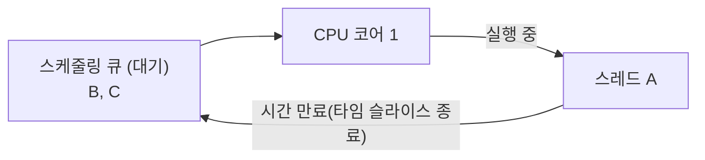
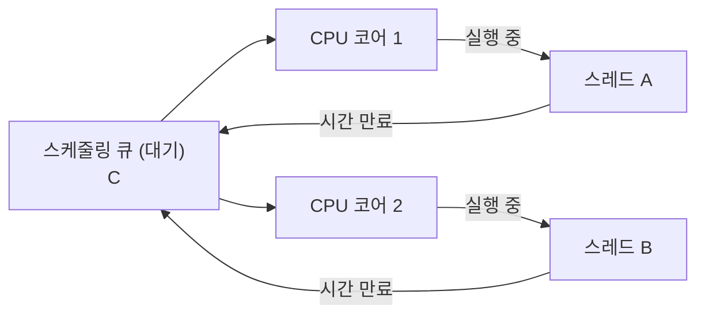

## 멀티태스킹과 멀티프로세싱

[멀티태스킹]
- 초창기 컴퓨터에는 하나의 CPU만 있었는데 프로그램 A 와 프로그램 B를 동시에 실행하려면 프로그램 A의 코드를 실행하고 끝난 뒤 프로그램 B를 실행하는 순서였다.
- 현대의 CPU의 처리속도는 초당 수십억 번의 연산을 수행한다.
- 두개 이상의 프로그램을 번갈아가면서 실행하면 사람은 동시에 실행하는것 처럼 느낀다.
- 이처럼 동시에 실행되는 것 처럼 하는 기법을 시분할(Time sharing,시간 공유)기법이라고 한다.
- p.s CPU에 어떤 프로그램이 얼마만큼 실행될지 결정하는데 이것을 스케줄링(Scheduling)이라 한다.

[멀티프로세싱]
- CPU 코어가 둘 이상이면 물리적으로 동시에 2개이상의 프로그램을 처리 할 수 있다.
- 컴퓨터 시스템에서 둘 이상의 프로세서(CPU 코어)를 사용하여 여러 작업을 동시에 처리하는 기술을 얘기한다.
- 멀티프로세싱 시스템은 하나의 CPU 코어만 사용하는 시스템보다 훨씬 빠르게 처리가 가능하다.

[보충] 동시성(Concurrency) vs 병렬성(Parallelism)
- 멀티태스킹(시분할)은 **동시성**에 해당한다. 실제로는 한 순간에 하나의 코드만 실행되지만, 매우 빠르게 번갈아 실행되어 "동시에 실행되는 것처럼" 보이는 것이다.
- 멀티프로세싱(멀티 코어)은 **병렬성**에 해당한다. 물리적으로 서로 다른 코어에서 진짜로 동시에 코드가 실행된다.
- 즉, 코어가 1개면 동시성만 가능하고, 코어가 여러 개면 병렬성까지 가능해진다.

## 프로세스와 스레드

[프로세스]
- 프로그램은 실제 실행하기 전까지는 단순 파일에 불과
- 프로그램을 실행하면 프로세스가 만들어지고 프로그램이 실행된다.
- 운영체제 안에서 실행중인 프로그램을 프로세스라 한다.
- 각 프로세스는 독립적인 메모리 공간을 가지고 있으며, 운영체제에서 별도의 작업 단위로 분리되어 관리된다.
  - ex) 자바 프로그램을 실행 시 운영체제안에 자바 프로세스가 생성된다.
- [보충] 프로세스는 운영체제로부터 메모리, 파일 핸들 등의 **자원을 할당받는 단위**이고, 스레드는 그 자원 안에서 실제로 코드를 실행하는 **실행 흐름의 단위**라고 구분하면 이해하기 쉽다.
- 프로세스의 메모리 구성
  - 코드 섹션 : 실행할 프로그램의 코드가 저장되는 부분
  - 데이터 섹션 : 전역 변수 및 정적 변수가 저장되는 부분
  - 힙 (Heap) : 동적으로 할당되는 메모리 영역 
  - 스택 (Stack) : 메서드(함수) 호출 시 생성되는 지역 변수와 반환 주소가 저장되는 영역(스레드에 포함)

[그림] 프로세스 메모리 구조 (주소값이 낮은 곳 → 높은 곳)
```text
높은 주소
+-----------------------+
|        Stack          |  ← 아래 방향으로 증가 (함수 호출마다 쌓임)
|          ↓             |
|                        |
|          ↑             |
|         Heap           |  ← 위 방향으로 증가 (동적 할당마다 커짐)
+-----------------------+
|   Data (전역/정적 변수)   |
+-----------------------+
|         Code           |
+-----------------------+
낮은 주소
```
- 스택과 힙이 서로 반대 방향으로 자라기 때문에, 스택이 너무 깊어지거나(재귀 등) 힙이 너무 커지면 두 영역이 충돌해 문제가 생길 수 있다(예: StackOverflowError, OutOfMemoryError).

[스레드]
- 프로세스는 하나 이상의 스레드를 반드시 포함한다.
- 한 프로세스안에 여러 스레드가 존재할 수 있고, 프로세스가 제공하는 동일한 메모리 공간를 참조한다.
  - 단일 스레드 : 한 프로세스 내에 하나의 스레드만 존재
  - 멀티 스레드 : 한 프로세스 내에 여러 스레드가 존재
- 스레드는 CPU를 사용해 코드를 실행한다.
- "동일한 메모리 공간을 참조한다"는 정확히는 **코드/데이터/힙 영역을 공유**한다는 뜻이다. 반면 **스택은 스레드마다 별도로 가진다** (그래서 위 프로세스 메모리 구조도에서 스택이 스레드에 포함된다고 표시됨). 또한 각 스레드는 자신만의 레지스터와 프로그램 카운터(PC, 다음에 실행할 명령어 위치)도 따로 가지고 있어야 스레드마다 독립적으로 코드를 실행/중단할 수 있다.
  - 공유 O : 코드, 데이터, 힙
  - 공유 X (스레드별 독립) : 스택, 레지스터, PC

## 단일 코어 스케줄링
- 운영체제는 내부에 스케줄링 큐를 가지고 있고 ,각각의 스레드는 스케줄링 큐에서 대기한다.

[그림] 스케줄링 큐 ↔ CPU 코어


- 예를 들어 스레드 A, 스레드 B, 스레드 C가 스케줄링 큐에서 대기한다고 가정하였을때 처음엔 스레드 A가 CPU코어에서 실행후 시간이 되면 스레드A를 잠시 멈추고 다음 순서인 스레드 B를 CPU코어에서 실행한다. 이걸 계속 반복한다.

[그림] 시간에 따른 실행 순서 (코어가 1개라 항상 하나만 실행됨)
```text
시간 →
CPU 코어 1 : [  A  ][  B  ][  C  ][  A  ][  B  ][  C  ] ...
큐(대기)   :   B,C    C,A    A,B    B,C    C,A    ...
```
- [보충] 스레드 A → B로 바뀌는 순간, 실행 중이던 A의 레지스터/PC 값을 저장하고 B의 값을 복원하는 과정이 필요한데 이를 **컨텍스트 스위칭(Context Switching)**이라 한다. 이 과정 자체는 순수한 작업 처리가 아닌 오버헤드이므로, 스위칭이 너무 잦으면 오히려 전체 성능이 떨어질 수 있다.

[보충] 컨텍스트 스위칭 비용은 왜 발생하나
- 스위칭 순간 CPU는 실제 작업(코드 실행)을 전혀 하지 못하고, 오직 "저장하고 복원하는" 일만 한다. 즉 이 시간은 순수하게 낭비되는 시간이다.
  - 레지스터 값, PC(다음에 실행할 명령어 위치) 등 CPU 상태를 스레드 A의 것은 저장하고, 스레드 B의 것을 다시 불러온다 (이 상태 저장 공간을 TCB/PCB라 부른다).
  - 캐시 적중률(Cache Hit) 저하: CPU 캐시에는 방금까지 실행하던 A의 코드/데이터가 올라가 있는데, B로 바뀌면 이 캐시가 무의미해지고 B의 데이터를 다시 메모리에서 읽어와야 한다(캐시 미스 증가). 이 재적재(warm-up) 비용이 실제로는 레지스터 저장/복원보다 더 클 때가 많다.
  - 운영체제 스케줄러 자체를 실행하는 비용도 포함된다 (다음에 어떤 스레드를 실행할지 결정하는 연산).
- 그래서 타임 슬라이스(한 스레드에게 주는 실행 시간)를 얼마로 정하느냐가 트레이드오프가 된다.
  - 타임 슬라이스를 너무 짧게 잡으면 → 스위칭이 자주 일어나 오버헤드 비중이 커져 전체 처리량(throughput)이 감소한다.
  - 타임 슬라이스를 너무 길게 잡으면 → 오버헤드는 줄지만, 다른 스레드가 그만큼 오래 대기해야 해서 체감 반응성(응답 속도)이 떨어진다.
- 참고로 스레드 간 전환(같은 프로세스 내부)은 프로세스 간 전환보다 비용이 더 싸다. 프로세스를 전환할 때는 메모리 주소 공간 자체를 바꿔야 해서(가상 메모리 매핑 테이블 교체 등) 캐시/TLB(주소 변환 캐시)까지 통째로 무효화되기 때문이다.

```text
[스레드 A 실행 중]
     │
     ▼ (타임 슬라이스 종료 / 인터럽트 발생)
[A의 상태(레지스터, PC) 저장]   ─┐
[B의 상태(레지스터, PC) 복원]   ─┴─ 이 구간은 실제 작업이 0인 순수 오버헤드
     │
     ▼
[스레드 B 실행 시작]
```

## 멀티 코어 스케줄링
- 물리적으로 동시에 실행이 가능한 상태로 ,각각의 스레드는 역시 스케줄링 큐에서 대기한다.

[그림] 스케줄링 큐 ↔ CPU 코어 여러 개


- 예를 들어 스레드 A, 스레드 B, 스레드 C가 스케줄링 큐에서 대기한다고 가정하였을때 처음엔 스레드 A,B가 각 CPU코어에서 실행후 시간이 되면 스레드A,B를 잠시 멈추고 다음 순서인 스레드 C,A를 CPU코어에서 실행한다. 이걸 계속 반복한다.

[그림] 시간에 따른 실행 순서 (코어가 2개라 매 순간 2개씩 동시 실행됨)
```text
시간 →
CPU 코어 1 : [  A  ][  C  ][  B  ][  A  ] ...
CPU 코어 2 : [  B  ][  A  ][  C  ][  C  ] ...
큐(대기)   :    C      B      A     B,...
```
- [보충] 단일 코어 스케줄링과의 핵심 차이는, 큐에서 매번 동시에 꺼내가는 스레드 개수가 코어 수만큼이라는 점이다. 그래서 코어가 N개면 이론상 최대 N개의 스레드가 진짜로 동시에(병렬로) 실행될 수 있다.

## CPU 바운드 작업과 I/O 바운드 작업
- 스레드(작업)가 시간을 어디에 쓰는지에 따라 두 가지로 나눌 수 있다.

[CPU 바운드 (CPU-bound)]
- 작업 시간 대부분을 **CPU 연산**에 사용하는 작업.
- CPU가 쉬지 않고 계속 계산을 해야 끝나는 작업이라, CPU 코어를 거의 독점하려는 성향을 가진다.
  - ex) 대량의 숫자 계산, 이미지/영상 인코딩, 암호화 연산, 정렬 알고리즘 등
- 이런 작업은 CPU 코어 개수 이상으로 스레드를 늘려봐야 별 효과가 없다. 어차피 코어 수만큼만 동시에 실행되고, 나머지는 스케줄링 큐에서 대기 + 컨텍스트 스위칭 비용만 늘기 때문이다.
  - → 보통 CPU 바운드 작업은 **스레드 개수를 CPU 코어 개수와 비슷하게** 맞추는 것이 효율적이다.

[I/O 바운드 (I/O-bound)]
- 작업 시간 대부분을 **입출력(I/O) 대기**에 사용하는 작업.
  - ex) 파일 읽기/쓰기, 네트워크 요청(DB 조회, API 호출), 사용자 입력 대기 등
- I/O 작업 자체는 CPU가 아니라 디스크 컨트롤러, 네트워크 카드 등 다른 장치가 처리하며, 그 결과가 올 때까지 CPU는 사실상 놀고 있는 상태가 된다.
- 그래서 I/O 바운드 작업은 CPU 코어 개수보다 **훨씬 더 많은 스레드**를 만들어도 이득을 볼 수 있다. 스레드 A가 I/O 응답을 기다리는 동안, 그 사이에 CPU는 스레드 B를 실행시켜 놀지 않게 할 수 있기 때문이다.

[그림] CPU 바운드 vs I/O 바운드 시간 사용 비교
```text
CPU 바운드 스레드
[■■■■■■■■■■■■■■■■■■■■]  ■ = CPU 연산
                          (거의 전부 CPU 사용, 대기 거의 없음)

I/O 바운드 스레드
[■■□□□□□□□□□□□□□□■■□□]  ■ = CPU 연산, □ = I/O 응답 대기 (이 동안 CPU는 다른 스레드 실행 가능)
```

- [보충] 단일 코어 스케줄링/멀티 코어 스케줄링에서 다룬 "스레드 A가 CPU를 잠시 멈추고 B가 실행된다"는 상황은, 타임 슬라이스가 끝나서일 수도 있지만 **A가 I/O 요청을 하면서 스스로 CPU를 반납하는 경우**도 매우 흔하다. 이 경우엔 타임 슬라이스가 남아있어도 즉시 다음 스레드로 전환되는데, 이를 통해 CPU를 노는 시간 없이 계속 활용할 수 있다.
- [보충] 실제 애플리케이션(예: 웹 서버)은 대부분 I/O 바운드에 가깝다. DB 조회, 외부 API 호출 등 대기 시간이 길기 때문에, 스레드를 많이 띄우거나(스레드 풀) 비동기/논블로킹 방식을 사용해 CPU가 노는 시간을 최소화하는 것이 성능에 큰 영향을 준다.

[실무 예시] FFmpeg 기반 CCTV 스트리밍은 어디에 속할까?
- 하나의 성격으로 단정하기 어렵고, **파이프라인 구간마다 성격이 다른 혼합형(mixed workload)**에 가깝다.

| 구간 | 하는 일 | 성격 |
|---|---|---|
| 카메라 → 서버 | RTSP/RTP로 영상 수신 | I/O 바운드 |
| 인코딩/트랜스코딩 (`libx264`, `libx265` 등 소프트웨어 인코딩) | H.264/H.265 압축 연산 | **CPU 바운드** |
| 인코딩 (NVENC/QuickSync/VAAPI 등 하드웨어 가속) | 압축 연산을 GPU/전용 칩에 위임 | I/O 바운드에 가까움 |
| 리먹싱/패스스루 (`-c copy`) | 재인코딩 없이 컨테이너만 변환 | I/O 바운드 |
| 서버 → 클라이언트 | 스트림 송출, 녹화 파일 쓰기 | I/O 바운드 |

- 특히 **여러 해상도/비트레이트로 동시에 뽑아내는 ABR(Adaptive Bitrate)** 처럼 카메라 채널 수 × 출력 프로파일 수만큼 소프트웨어 인코딩 스레드가 늘어나는 구조라면, CPU 사용률이 채널 수에 거의 선형으로 비례해 올라가는 전형적인 CPU 바운드 부하가 된다.
- 반대로 인코딩 없이 스트림만 중계/저장하는 구간은 순수 I/O 바운드라서, 병목은 CPU가 아니라 네트워크 대역폭이나 디스크 쓰기 속도가 된다.
- 그래서 채널을 늘릴 때 "코어를 늘려야 하는지 vs 네트워크/디스크를 늘려야 하는지"는 **인코딩 구간이 소프트웨어인지 하드웨어 가속인지**에 따라 달라진다. 소프트웨어 인코딩 비중이 크다면 앞서 정리한 CPU 바운드 원칙(스레드 수 ≈ 코어 수)이, 리먹싱/전송 위주라면 I/O 바운드 원칙(스레드를 코어 수보다 많이 둬도 이득)이 적용된다.
